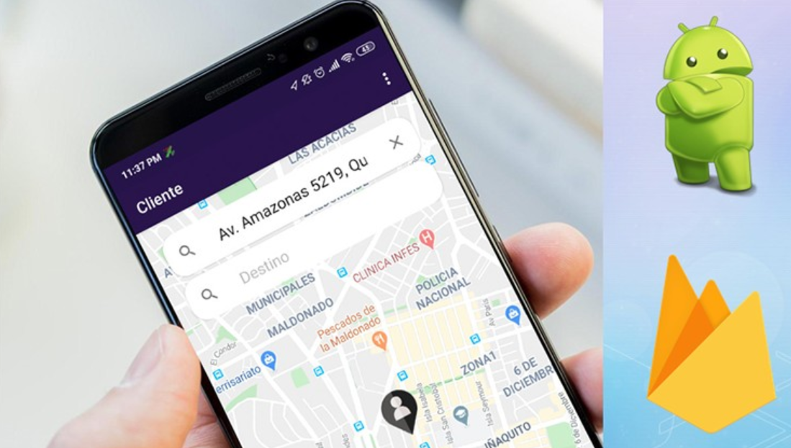

# Uber Clone con android studio y Firebase

## Descripcion 

Curso tomado en la platafoma Udemy

https://www.udemy.com/course/crea-una-app-como-uber-utilizando-android-studio-y-firebase/

Desarrollemos 1 app con la mayoria de la funcionales de Uber con Android y Firebase avanzado - Crea una aplicación como UBER

El curso es impartido por Jonathan Goyes

## Galeria

## Lo que se aprendera 

- Diseño de pantallas con XML
- Material Design
- Intregracion de App Android con Firebase
- Login y registro de usuarios con Firebase Authentication
- Manejo de datos en tiempo real con Firebase Database
- Notificaciones Push Avanzadas con Firebase Cloud Messaging
- Guardar y mostrar imágenes con Firebase Storage
- Como hacer relaciones de datos en bases de datos NOSQL
- Integracion con Google Maps API
- Manejo avanzado de Google Places API
- Trazar rutas entre un punto A y B (origen y destino) utlizando Google Directions API
- Geolocalizacion avanzada con Firebase Geofire y Google Directions API
- Recycler View y Firebase Realtime Database
- Peticiones HTTP desde aplicación Android
- Colocar Marcadores en Google Maps
- Manejo avanzado del GPS
- Android X
